# CalRatioTrainer

Train the CalRatio 2019 RNN

## Introduction

This is far from production!

## Usage

This isn't meant to be an exploratory thing as much as "easy-to-run".

* `cr_trainer train --help` to see all the command line options.
* `cr_trainer train` will run the default (test) training. The test training has a reduced size signal file. However, everything is large enough to stress out the system. Good for running tests locally on your CPU. Results are stored under `training_results`, which is created in your current directory.

Some quick notes:

* The first time you run this, it will copy down data files and cache them locally. You can change the cache location or file location using the configuration file.
* The output directory contains a complete set of the options that were used in the run, so it is easy to see exactly how a run was configured.
* test samples can run on a 16GB V100 if you do mini-match splitting of 15.

### Running Parameters

This is always an issue of trying to keep the number of min batches small to improve performance and now overflow your memory. Recorded below are a few running configurations:

* Laptop, i7, 32 GB, Windows, running on the test data: '--num_splits 2`.
* Chicago AF, V100 (16 GB), 4 CPU with 32 GB, running on the test data: `--num_splits 10`.
* Chicago AF, V100 (16 GV), 4 CPU with 32 GB, running on the full Run 2 data: `--num_splits 230`. Running a full 100 epochs takes 2 hours.
* Chicago AF, A100 (40 GB), 4 CPU with 32 GB, running on the full Run 2 data: `--num_splits 7`. Not clear this is well behaved from a training POV, however.

### Data

The following training datasets are used:

| Dataset Name | Source | Description |
| --- | --- | --- |
| X | `main_training_file` | The main Training File |

The following dataflow diagram attempts to follow the flow of training and control input data through the algorithm.

```mermaid
graph TD;
    main_training_file-->X;
    main_training_file-->Z;
    main_training_file-->weights;
    main_training_file-->mcWeights[mcWeights _reweight_];
    weights-->weights_train[weights_train 90%];
    weights-->weights_test[weights_test 10%];
    mcWeights-->mcWeights_train[mcWeights_train 90%];
    mcWeights-->mcWeights_test[mcWeights_test 90%];
    cr_training_file-->X_adversary;
    cr_training_file-->Z_adversary;
    cr_training_file-->weights_adversary;
    cr_training_file-->mcWeights_adversary[mcWeights _reweight_];
    weights_adversary-->weights_train_adversary[weights_train_adversary 90%];
    weights_adversary-->weights_test_adversary[weights_test_adversary 90%];
    mcWeights_adversary-->mcWeights_train_adversary[mcWeights_train_adversary 90%];
    mcWeights_adversary-->mcWeights_test_adversary[mcWeights_test_adversary 90%];
    X-->X_train[X_train 90%];
    X-->X_test[X_test 10%];
    Z-->Z_train[Z_train 90%];
    Z-->Z_test[Z_test 10%];
    X_adversary-->X_train_adversary[X_train_adversary 90%];
    X_adversary-->X_test_adversary[X_test_adversary 10%];
    Z_adversary-->Z_train_adversary[Z_train_adversary 90%];
    Z_adversary-->Z_test_adversary[Z_test_adversary 10%];
    X_test-->X_test2[X_test 50%];
    X_test-->X_val[X_val 50%];
    weights_test-->weights_test2[weights_test 50%];
    weights_test-->weights_val[weights_val 50%];
    mcWeights_test-->mcWeights_test2[mcWeights_test 50%];
    mcWeights_test-->mcWeights_val[mcWeights_val 50%];
    Z_test-->Z_test2[Z_test 50%];
    Z_test-->Z_val[Z_val 50%];
    X_test_adversary-->X_test_adversary2[x_test_adversary 50%];
    X_test_adversary-->X_val_adversary[x_val_adversary 50%];
    weights_test_adversary-->weights_test_adversary2[weights_test_adversary 50%];
    weights_test_adversary-->weights_val_adversary[weights_val_adversary 50%];
    mcWeights_test_adversary-->mcWeights_test_adversary2[mcWeights_test_adversary 50%];
    mcWeights_test_adversary-->mcWeights_val_adversary[mcWeights_val_adversary 50%];
    X_train-->X_train2[X_train hi/lo mass, pad];
    Z_train-->X_train2;
    Z_train-->Z_train2[Z_train hi/lo mass, pad];
    weights_train-->weights_train2[weights_train hi/lo mass, pad];
    Z_train-->weights_train2
    mcWeights_train-->mcWeights_train2[mcWeights_train hi/lo mass, pad];
    Z_train-->mcWeights_train;
    Z_train0-->Z_train2[Z_train hi/lo mass, pad];

    mcWeights_val_adversary-->small_mcWeights_val_adversary;
    weights_val_adversary_orig-->small_weights_val_adversary;
    y_to_validate_adv-->small_y_val_adversary;
    x_to_validate_adv_orig-->small_x_val_adversary;
    weights_train_adversary_s-->small_weights_train_adversary;
    y_to_train_adversary_orig-->small_y_to_train_adversary;
    x_to_adversary_orig-->small_x_to_adversary;

    x_to_adversary_orig-->|pad| x_to_adversary;
    x_to_train-->|pad value| x_to_adversary;

    x_to_validate_adv-->|pad| x_to_validate_adv2[x_to_validate_adv];
    x_to_validate-->|pad value| x_to_validate_adv;

    weights_train_adversary-->|pad| weights_train_adversary_s[weights_train_adversary];
    weights_to_train-->|pad value| weights_train_adversary2;

    weights_val_adversary-->|pad|weights_val_adversary_values2[weights_val_adversary_values];
    weights_to_validate-->weights_val_adversary_values2

    x_to_train-->|split by mini-batch|x_to_train_split;
    x_to_adversary-->|split by mini-batch|x_to_adversary_split;

    weights_to_train-->|split by mini-match| weights_to_train_0;
    weights_train_adversary2-->|split by mini-batch| small_x_to_adversary_split;

    small_weights_train_adversary-->|split by mini-batch| small_weights_train_adversary_s;

    x_to_validate-->|split by mini-batch| x_to_validate_split;
    x_to_validate_adv2-->|split by mini-batch| x_to_validate_adv_split;

    weights_to_validate-->|split by mini-batch| weights_to_validate_0;
    weights_val_adversary-->|split by mini-batch| weights_val_adversary_split;

    small_x_to_adversary_split-->|mini-batch| discriminator_model[discriminator_model training];
    small_y_to_train_adversary_0-->|mini-batch| discriminator_model;
    small_weights_train_adversary-->|mini-batch| discriminator_model;
    discriminator_model-->last_disc_loss;
    discriminator_model-->last_disc_bin_acc;

    x_to_train_split-->|mini-batch| train_inputs;
    x_to_adversary_split-->|mini-batch| train_inputs;

    y_to_train_0-->|mini-batch| train_outputs;
    y_to_train_adversary_squeeze-->|mini-batch| train_outputs

    weights_to_train_0-->|mini-batch| train_weights;
    weights_train_adversary_s-->|mini-batch| train_weights;

    train_inputs-->original_model[original_model training];
    train_outputs-->original_model;
    train_weights-->original_model;
    original_model-->last_loss;
    original_model-->last_main_output_loss;
    original_model-->last_adversary_loss;
    original_model-->last_main_cat_acc;
    original_model-->last_adv_bin_acc;
```

Notes:

* A `2` at the end of the same name, `X_test2` means that the variable `X_test` was replaced (and so on).
* There are three catagories for the main data, `0: Signal`, `1: MC Mulitjet`, and `2: BIB`.
* There are two catagories for the adversary data, `0:xxx` and `1:xxx`
* `Y` variables are not mentioned as they contain the "truth".
* `X` is all columns including jet info and clusterSS, and track, and muon segment.
* `Z` is the LLP truth information (for parameterize training?)
* `weights` are the raw weights that come from the file we read in. `mcWeights` is rescaled so QCD and Signal have the same weight.

### Plots

By default, as the training runs, a great deal of plots are produced. This list below is an attempt to understand those plots.

* The `keras` directory contains a copy of the model and check points of the training parameters. The training parameters aren't written for every epoch, only where the K-S test for BIB is below `0.3` (see below). The `checkpoint` files are written after every epoch and give you the most recently completed weights, good or bad.
* The output directory for the run contains lots of files that begin with an integer - these.

#### Per-Epoch Plots

15 plots are produced each epoch to make for easy tracking.

| file-name | Description |
| --- | --- |
| `<nnn>_main__(bib, qcd, sig)_predictions_linear` | Each plot shows one of the three outputs of the NN when run on xxx by the type of data. Excellent to see the performance: one expects the signal to be piled at the right, for example, for the signal output of the NN. The test data is used to generate these plots. |
| `<nnn>_val_adversary__(bib, qcd, sig)_predictions` | Same plots, but using the `small_val_adversary` dataset. |
| `<nnn>_val_adversary_(highPt, midPt, lowPt)_(bib, qcd, sig)_predictions` | Same as the `val_adversary` plots above, but split by $p_T$. Low is $p_T < 0.25$, mid is $0.25 < p_T < 0.50$, and high is $p_T > 0.5$. |

#### Final Plots

| file-name | Description |
| --- | --- |
| `main_nn_loss` | The loss from the main network on test data and training data. Can check by-eye for performance and (see warning) overtraining. Dumped from `original_lossf` and `val_original_lossf`. The validation dataset is the full dataset. WARNING (TODO): The main loss is only the last mini-batch and so will be statistically limited! |
| `ks_(bib, qcd, sig)` | The K-S test results per epoch. Calculated in the `do_checkpoint_prediction_histogram` method (called once per epoch). |

## Installation

Installation instructions are generally tricky: this really needs to be trained on a GPU.

### WSL2

This is without using the GPU (so good for testing).

1. Open up an instance. If you are using the full Run 2 dataset, then you'll need the 40GB instance to be as efficient as possible.
1. Open a terminal window
1. `git clone https://github.com/gordonwatts/CalRatioTrainer.git` into whatever directory you want to run out of, in a new virtual environment.
1. `cd CalRatioTrainer`
1. `pip install -e .[wsl2]`
    * If you want to do development, etc., then do `pip install -e .[test,wsl2]`

This should work anywhere you are using a clean environment. It will install `TensorFlow`, for example. It is always a fight getting the right version of TF and the underlying GPU libraries to work together, so you may have to fiddle after the install depending on your setup. Feel free to submit PR's if you find something that might be interesting to others!

### Chicago Analysis Facility

The installation is expected to take place on a Jupyter instance where the proper TF libraries have already been installed.

1. Open up an instance. If you are using the full Run 2 dataset, then you'll need the 40GB instance to be as efficient as possible.
1. Open a terminal window
1. `git clone https://github.com/gordonwatts/CalRatioTrainer.git` into whatever directory you want to run out of.
1. `cd CalRatioTrainer`
1. `pip install -e .`
    * If you want to do development, etc., then do `pip install -e .[test]`

You should be ready to go!

## Acknowledgements

This is based on the work originally done by Felix in the CalRatio group in ATLAS. This RNN was published in xxx.
The running and design has been improved since then.

Changes from Felix's original code.

Cosmetic:

* Only code directly used to do the training, etc., was copied over.
* All code is formatted using `black` and `flake8` for readability.
* Sub-commands using `argparse` are used to control
* Use `pydantic` to steer the training, and allow for command line arguments to be used.
* Use the directory `training_results` to store all results. That directory contains the `model_name`,
  and under that the run number.
* It is possible to "continue" a training from a previous one. See help strings for `--continue-n` from the command help `cr_trainer train --help`.

Algorithmic:

* Do not recompile the model every or during all the adversary during mini-batches.
* Do not change the learning rate as a function of the epoch
* Removed cross-validation code

Typical training takes about 40 minutes on the full dataset, 100 epochs.
