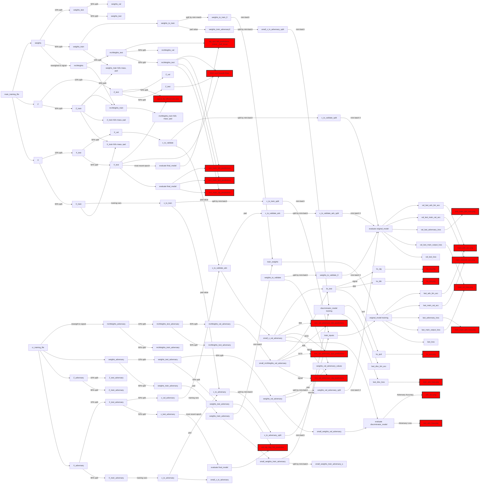

# CalRatioTrainer

Train the CalRatio 2019 RNN

## Introduction

This is far from production!

## Usage

This isn't meant to be an exploratory thing as much as "easy-to-run". Use `--help` to get a full description of other options.

* `cr_trainer train --help` to see all the command line options.
* `cr_trainer train` will run the default (test) training. The test training has a reduced size signal file. However, everything is large enough to stress out the system. Good for running tests locally on your CPU. Results are stored under `training_results`, which is created in your current directory.
* `cr_trainer plot --help` will tell you how to make comparison plots between different training data files.
* `cr_trainer plot` will generate a report comparing the test main training data and adversary training data file. The results are stored under `reports`, which is created in your current directory. Look at the `report.md` file for quick info.
* `cr _trainer analyze` will compare several runs looking for a _best_ epoch, make a few plots, and run a few comparisons on the `test` dataset.
* `cr_trainer convert training name/run/epoch` will convert that run's model with weights from that epoch to a `json` file that DiVertAnalysis's `fdeep` package can import and run.
* `cr_trainer convert divertanalysis file_path -data_type qcd` will convert the `DiVertAnalysisR21` output at `file_path` to a pre-training file. This can then be used to build a full training sample. Wildcards are allowed. Use `yaml` config to build a complete set. Note that the conversion is designed to skip errors (and files previously converted). It is important to look at the log messages that result from this run to make sure all the files you want processed have been processed. It is possible to run multiple copies of this command at once - they shouldn't step on each other.

Some quick notes:

* The first time you run this, it will copy down data files and cache them locally. You can change the cache location or file location using the configuration file.
* The output directory contains a complete set of the options that were used in the run, so it is easy to see exactly how a run was configured.
* test samples can run on a 16GB V100 if you do mini-match splitting of 15.

### Running Parameters

This is always an issue of trying to keep the number of min batches small to improve performance and now overflow your memory. Recorded below are a few running configurations:

* Laptop, i7, 32 GB, Windows, running on the test data: '--num_splits 2`.
* Chicago AF, V100 (16 GB), 4 CPU with 32 GB, running on the test data: `--num_splits 10`.
* Chicago AF, V100 (16 GV), 4 CPU with 32 GB, running on the full Run 2 data: `--num_splits 230`. Running a full 100 epochs takes 2 hours.
* Chicago AF, A100 (40 GB), 4 CPU with 32 GB, running on the full Run 2 data: `--num_splits 7`. Not clear this is well behaved from a training POV, however.

### Data

The following training datasets are used:

Dataset Name | Description |
| --- | --- |
| `main_training_file` | This training file contains the three types of jets the NN is to discriminate against - ones from decays in the calorimeter, ones from QCD, and ones from BIB (labeled with 1, 0, or 2). |
| `cr_training_file` | This training input file contains MC and Data for the multi-jets (labeled 0 and 2). They adversary uses these to punish the network from telling the difference between data and MC. |

The following dataflow diagram attempts to follow the flow of training and control input data through the algorithm. This was made by scanning the code. Red items are output plots.



Notes:

* There are cases where an operation is done on a variable and resulting variable has the same name. This is because in the code the label is transferred to the new data, and we are trying to remain faithful to the code.
* There are three catagories for the main data, `0: Signal`, `1: MC Mulitjet`, and `2: BIB`.
* There are two catagories for the adversary data, `0:xxx` and `1:xxx`
* `Y` variables are not mentioned as they contain the "truth".
* `X` is all columns including jet info and clusterSS, and track, and muon segment.
* `Z` is the LLP truth information (for parameterize training?)
* `weights` are the raw weights that come from the file we read in. `mcWeights` is rescaled so QCD and Signal have the same weight.
* The `small` data variables are basically the un-padded/unextended data. They are often used to evaluate the discriminator.

### Plots

By default, as the training runs, a great deal of plots are produced. This list below is an attempt to understand those plots.

* The `keras` directory contains a copy of the model and check points of the training parameters. The training parameters aren't written for every epoch, only where the K-S test for BIB is below `0.3` (see below). The `checkpoint` files are written after every epoch and give you the most recently completed weights, good or bad.
* The output directory for the run contains lots of files that begin with an integer - these are the per-epoch plots.
* There are three types of data: training data, test data, and validation data. The training data is 90% of the data in the input data-files. The test and validation data are the remaining 10% split 50-50.

#### Per-Epoch Plots

15 plots are produced each epoch to make for easy tracking.

| file-name | Description |
| --- | --- |
| `<nnn>_main__(bib, qcd, sig)_predictions_linear` | Each plot shows one of the three outputs of the NN when run on xxx by the type of data. Excellent to see the performance: one expects the signal to be piled at the right, for example, for the signal output of the NN. The test data is used to generate these plots. |
| `<nnn>_val_adversary__(bib, qcd, sig)_predictions` | Same plots, but using the `small_val_adversary` dataset, which is half the dataset that was originally used for testing. This are on the adversary dataset, with only data and multijet MC (you'll note there is no BIB in these plots). Do not be fooled by the legend text |
| `<nnn>_val_adversary_(highPt, midPt, lowPt)_(bib, qcd, sig)_predictions` | Same as the `val_adversary` plots above, but split by $p_T$. Low is $p_T < 0.25$, mid is $0.25 < p_T < 0.50$, and high is $p_T > 0.5$. |
| `<nnn>_main_(bib, qcd, sig)_predictions` | The main network output distributions for each of the output variables (bib, qcd, and signal). In each plot, if the training is working well, you should see the bib pushed up against the right edge of the bib NN output, and same for QCD for the QCD NN output, etc. Good to check to see if the network is learning how to differentiate between signal and its two backgrounds. |

* $p_T$ is rescaled to xx. This means 0.25 is xx, and 0.50 is yy.

#### Final Plots

Most final plots are made after every single epoch so that you can see the progress as training is running (the `ROC` and $S/\sqrt{B}$ are the exception).

| file-name | Description |
| --- | --- |
| `main_nn_loss` | The loss from the main network on test data and training data. Can check by-eye for performance and (see warning) overtraining. Dumped from `original_lossf` and `val_original_lossf`. The validation dataset is the full dataset. WARNING (TODO): The main loss is only the last mini-batch and so will be statistically limited! |
| `main_network_acc` | The main network on the validation dataset |
| `test_main_adv_loss` | The advisory network loss on the test dataset. |
| `train_adv_loss` | The advisory network loss on the training dataset. |
| `train_main_adv_loss` | The main network loss on the training adversary dataset. |
| `main_adv_acc` | The loss of the adversary network on the test and training adversary datasets. Only the last mini-batch is used for this measurement. |
| `ks_(bib, qcd, sig)` | The K-S test results per epoch. Calculated once per epoch on the adversary validation dataset. The similarity test is between the QCD and MC data, making sure the NN output is the same. Presumably, a small K-S value means small MC/Data systematic errors. |
| `(qcd, bib, sig)_signal_predictions` | Plots of the three types of training data's NN output on the test dataset. Great for a quick eyeball of how the network is working. Run on the test sample. |
| `adv (qcd, bib, sig)_signal_predictions` | Plots of the three types of training data's NN output on the adversary test dataset (no BIB data). Tells you how well the network is telling the difference between QCD and MC (see the K-S tests, which are exactly this). |
| `test_adv_loss`, `test_adv_acc` | The loss and accuracy of the adversary network on the validation dataset.  |
| `roc_curve_atlas_rej_bib_mH1000.0` and friends | ROC curves of various flavors calculated on the test dataset. |
| `SoverB_scan_BIB only` and friends | Signal of Background of various flavors calculated on the test dataset. |
| `signal_llp_efficiencies` | Summary plot in $m_S$ and $m_H$ space of the efficiencies of signal detection on the test dataset. |

## Installation

Installation instructions are generally tricky: this really needs to be trained on a GPU.

### WSL2

This is without using the GPU (so good for testing).

1. Open up an instance. If you are using the full Run 2 dataset, then you'll need the 40GB instance to be as efficient as possible.
1. Open a terminal window
1. `git clone https://github.com/gordonwatts/CalRatioTrainer.git` into whatever directory you want to run out of, in a new virtual environment.
1. `cd CalRatioTrainer`
1. `pip install -e .[wsl2]`
    * If you want to do development, etc., then do `pip install -e .[test,wsl2]`

This should work anywhere you are using a clean environment. It will install `TensorFlow`, for example. It is always a fight getting the right version of TF and the underlying GPU libraries to work together, so you may have to fiddle after the install depending on your setup. Feel free to submit PR's if you find something that might be interesting to others!

### Chicago Analysis Facility

The installation is expected to take place on a Jupyter instance where the proper TF libraries have already been installed.

1. Open up an instance. If you are using the full Run 2 dataset, then you'll need the 40GB instance to be as efficient as possible.
1. Open a terminal window
1. `git clone https://github.com/gordonwatts/CalRatioTrainer.git` into whatever directory you want to run out of.
1. `cd CalRatioTrainer`
1. `pip install -e .`
    * If you want to do development, etc., then do `pip install -e .[test]`

You should be ready to go!

## Development

To install the package once checked out, use the `test` option to make sure to get various development packages:

```bash
pip install -e .[wsl2,test]
```

### Profiling

To get a nice dump of what is called during a run, you can use `pytest`'s profile tool:

```bash
pytest --profile  tests/convert/test_convert_divert.py::test_sig_file
snakeviz -s prof/test_sig_file.prof
```

And click on the `url` that `snakeviz` prints out. This will give you a timing trace for the test `test_sig_file` (or whatever you want).

## Acknowledgements

This is based on the work originally done by Felix Cormier in the CalRatio group in ATLAS. This RNN was published in xxx. Substantial work was further done by Alex Golub to improve the performance and design (which was checked-in wholesale by G. Watts).

Changes from Felix's original code.

Cosmetic:

* Only code directly used to do the training, etc., was copied over.
* All code is formatted using `black` and `flake8` for readability.
* Sub-commands using `argparse` are used to control
* Use `pydantic` to steer the training, and allow for command line arguments to be used.
* Use the directory `training_results` to store all results. That directory contains the `model_name`,
  and under that the run number.
* It is possible to "continue" a training from a previous one. See help strings for `--continue-n` from the command help `cr_trainer train --help`.

Algorithmic:

* Do not recompile the model every or during all the adversary during mini-batches.
* Do not change the learning rate as a function of the epoch
* Removed cross-validation code

Typical training takes about 40 minutes on the full dataset, 100 epochs.

As further work has progressed, we've cataloged differences in issues with the tag [Changed 2019](https://github.com/gordonwatts/CalRatioTrainer/issues?q=is%3Aissue+label%3AChanged2019+is%3Aclosed)
